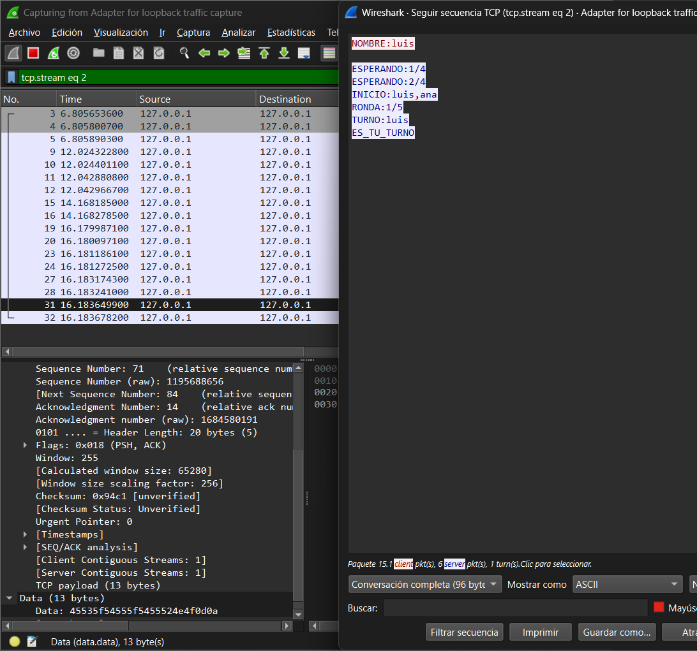

[ <- Volver al inicio](/README.md)

# Paso 1 – Captura Wireshark sin cifrado

## Configuración

- Interfaz: Loopback (`\Device\NPF_Loopback`)
- Herramienta: Wireshark

## Procedimiento

1. Abrir Wireshark y seleccionar la interfaz Loopback.
2. Arrancar el servidor y dos clientes (versión sin cifrado).
3. Jugar una ronda completa.
4. Click derecho sobre un paquete [PSH, ACK] → Follow → TCP Stream.

## Resultado

Con la versión sin cifrado, Wireshark muestra el contenido
de los mensajes en texto plano dentro del TCP Stream.

Los mensajes intercambiados son completamente legibles:

| Dirección          | Mensaje visible      |
| ------------------ | -------------------- |
| Cliente → Servidor | `NOMBRE:Juan`        |
| Servidor → Cliente | `ESPERANDO:1/4`      |
| Servidor → Cliente | `ES_TU_TURNO`        |
| Cliente → Servidor | `LANZAR`             |
| Servidor → Cliente | `DADOS:3,5,2,6,1`    |
| Servidor → Cliente | `PUNTOS:Juan:32`     |
| Servidor → Cliente | `FIN:Juan:95,Ana:87` |

## Capturas

## Conclusión

Cualquier persona en la misma red puede usar Wireshark
para leer todos los mensajes del juego en tiempo real.
Esto demuestra la necesidad de cifrar la comunicación.

[ <- Volver al inicio](/README.md)
