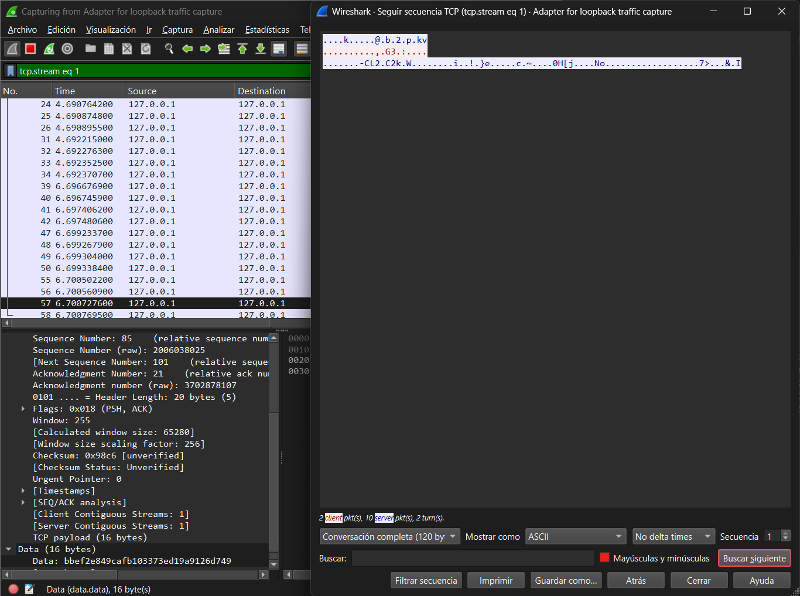

[ <- Volver al inicio](/README.md)

# Paso 4 – Captura Wireshark con cifrado activo

## Configuración

- Interfaz: Loopback (`\Device\NPF_Loopback`)
- Herramienta: Wireshark

## Procedimiento

1. Abrir Wireshark y seleccionar la interfaz Loopback.
2. Arrancar el servidor y dos clientes (versión con cifrado AES).
3. Jugar una ronda completa.
4. Click derecho sobre un paquete [PSH, ACK] → Follow → TCP Stream.

## Resultado

Con el cifrado AES activo, el TCP Stream ya no muestra
ningún texto legible. El contenido es una secuencia de
bytes binarios sin significado aparente.

Lo único reconocible son los primeros 4 bytes de cada
mensaje, que corresponden al entero de longitud que
escribe `DataOutputStream.writeInt()`.

## Capturas

<!-- Sustituir por tu captura real -->

## Comparativa

| Aspecto                | Sin cifrado (paso 1)      | Con cifrado AES (paso 4) |
| ---------------------- | ------------------------- | ------------------------ |
| Contenido visible      | Texto plano legible       | Bytes binarios           |
| Nombres de usuario     | Visibles                  | Ocultos                  |
| Comandos del juego     | Visibles (`LANZAR`, etc.) | Ocultos                  |
| Puntuaciones           | Visibles                  | Ocultas                  |
| Resistencia a sniffing | Ninguna                   | Alta (AES 128 bits)      |

[ <- Volver al inicio](/README.md)
